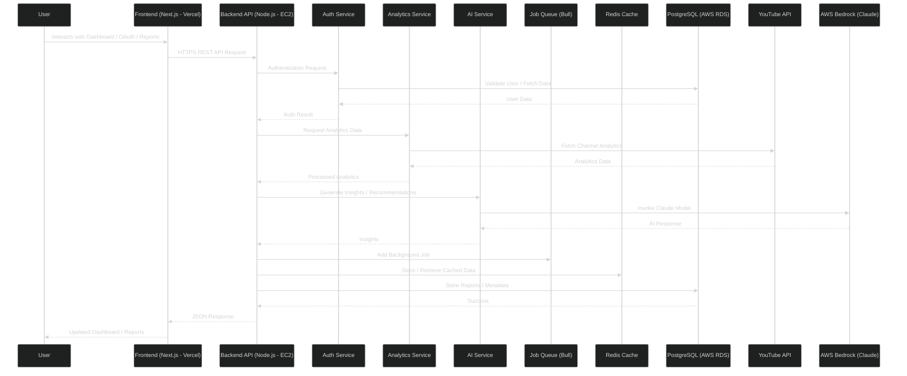
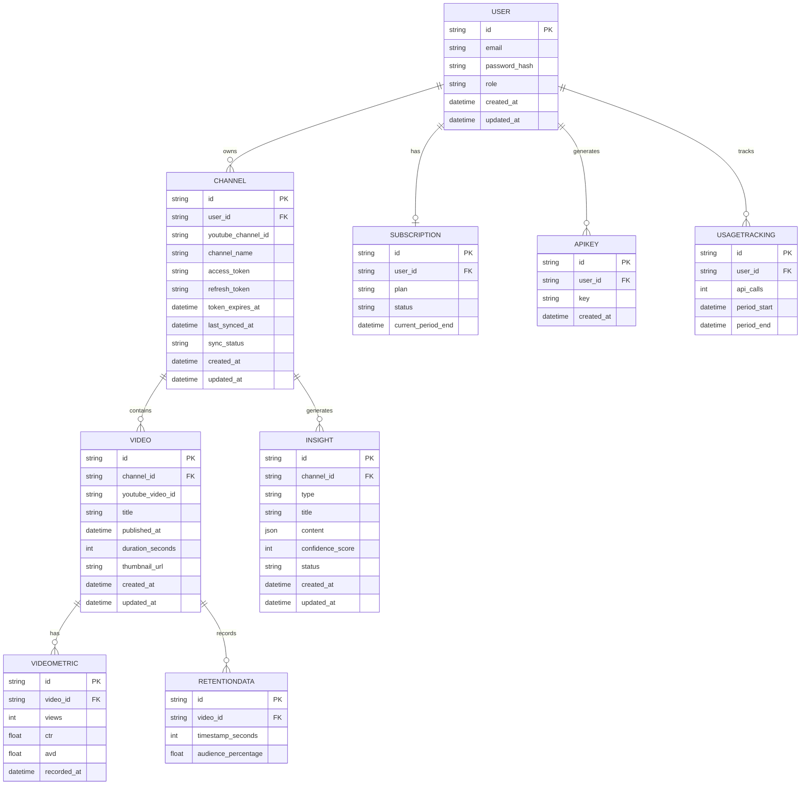

# Overview

YouTube Growth Intelligence is an infrastructure-level AI system that provides YouTube creators with data-driven content optimization recommendations. The system follows a three-tier architecture:

1. **Frontend Layer**: Next.js application providing creator dashboard and OAuth flows
2. **Backend Layer**: Node.js/Express API handling business logic, YouTube API integration, and AI orchestration
3. **Data Layer**: PostgreSQL database with Prisma ORM for structured data storage

The system integrates with YouTube Analytics API for data ingestion and AWS Bedrock for AI-powered content analysis and generation. Background jobs handle asynchronous processing of analytics sync and AI generation tasks.

**Key Design Principles**:

- API-first architecture for future extensibility
- Asynchronous processing for long-running operations
- Caching strategy to minimize API costs and latency
- Modular design for independent component scaling
- Security-first approach for OAuth token management

## Architecture

### High-Level System Architecture

# System Sequence Diagram



### Component Interaction Flow

**User Authentication Flow**:

1. User visits frontend → Next.js app
2. User clicks "Connect YouTube" → OAuth redirect to Google
3. Google returns authorization code → Backend exchanges for tokens
4. Backend stores encrypted tokens → PostgreSQL
5. Backend returns JWT session token → Frontend stores in httpOnly cookie

**Analytics Sync Flow**:

1. Cron job triggers every 24 hours → Job queue
2. Worker picks up job → Fetches channel list from database
3. Worker calls YouTube Analytics API → Retrieves metrics
4. Worker stores raw data → PostgreSQL analytics tables
5. Worker updates sync status → Marks channel as synced

**AI Generation Flow**:

1. User requests insight → Frontend calls backend API
2. Backend validates request → Checks subscription tier limits
3. Backend enqueues AI job → Job queue with channel context
4. Worker picks up job → Fetches relevant analytics data
5. Worker calls AWS Bedrock → Sends prompt with data
6. Worker stores generated insight → PostgreSQL
7. Worker updates job status → Frontend polls for completion

## Components and Interfaces

### Frontend Components

**1. Dashboard Component**

- Displays key metrics: subscriber count, growth rate, avg CTR, avg AVD
- Shows recent insights with implementation status
- Provides quick actions: "Generate Video Ideas", "Analyze Retention", "Optimize Title"
- Real-time updates via polling or WebSocket connection

**2. OAuth Flow Component**

- Initiates Google OAuth consent flow
- Handles callback with authorization code
- Displays connection status and channel information
- Allows disconnection and re-authorization

**3. Insights Component**

- Lists generated insights by type (video ideas, titles, thumbnails, hooks)
- Displays confidence scores and rationale
- Allows marking insights as implemented or dismissed
- Provides export functionality

**4. Analytics Visualization Component**

- Renders retention curves using Chart.js or Recharts
- Displays trend graphs for key metrics
- Shows comparative analysis (current vs previous period)
- Highlights drop-off points and anomalies

### Backend Services

**1. AuthService**

```typescript
interface AuthService {
  // User authentication
  register(email: string, password: string): Promise<User>
  login(email: string, password: string): Promise<{ user: User, token: string }>
  verifyToken(token: string): Promise<User>
  resetPassword(email: string): Promise<void>
  
  // YouTube OAuth
  initiateYouTubeOAuth(): string  // Returns OAuth URL
  handleOAuthCallback(code: string, userId: string): Promise<Channel>
  refreshAccessToken(channelId: string): Promise<void>
  revokeAccess(channelId: string): Promise<void>
}
```

**2. AnalyticsService**

```typescript
interface AnalyticsService {
  // Data ingestion
  syncChannelData(channelId: string): Promise<SyncResult>
  fetchVideoMetrics(channelId: string, videoIds: string[]): Promise<VideoMetrics[]>
  fetchRetentionCurve(videoId: string): Promise<RetentionData>
  fetchTrafficSources(videoId: string): Promise<TrafficSource[]>
  
  // Data retrieval
  getChannelMetrics(channelId: string, period: DateRange): Promise<ChannelMetrics>
  getTopVideos(channelId: string, metric: 'views' | 'ctr' | 'avd', limit: number): Promise<Video[]>
  getRetentionAnalysis(videoId: string): Promise<RetentionAnalysis>
  
  // Caching
  getCachedMetrics(channelId: string): Promise<ChannelMetrics | null>
  setCachedMetrics(channelId: string, metrics: ChannelMetrics, ttl: number): Promise<void>
}
```

**3. AIService**

```typescript
interface AIService {
  // Content generation
  generateVideoIdeas(channelId: string, count: number): Promise<VideoIdea[]>
  generateThumbnailConcepts(videoContext: VideoContext): Promise<ThumbnailConcept[]>
  optimizeTitle(originalTitle: string, channelContext: ChannelContext): Promise<TitleSuggestion[]>
  rewriteHook(originalHook: string, retentionData: RetentionData): Promise<HookSuggestion[]>
  
  // Analysis
  analyzeRetention(videoId: string): Promise<RetentionInsights>
  generateGrowthDiagnostic(channelId: string): Promise<GrowthDiagnostic>
  
  // Prompt management
  buildPrompt(template: PromptTemplate, context: any): string
  callBedrockAPI(prompt: string, model: string): Promise<string>
  parseAIResponse(response: string, expectedFormat: string): any
}
```

**4. JobService**

```typescript
interface JobService {
  // Job management
  enqueueJob(type: JobType, payload: any, priority: number): Promise<Job>
  getJobStatus(jobId: string): Promise<JobStatus>
  cancelJob(jobId: string): Promise<void>
  
  // Job processing
  processAnalyticsSync(channelId: string): Promise<void>
  processAIGeneration(request: AIRequest): Promise<Insight>
  
  // Job monitoring
  getQueueDepth(): Promise<number>
  getFailedJobs(limit: number): Promise<Job[]>
  retryFailedJob(jobId: string): Promise<void>
}
```

**5. SubscriptionService**

```typescript
interface SubscriptionService {
  // Subscription management
  createSubscription(userId: string, tier: SubscriptionTier): Promise<Subscription>
  updateSubscription(subscriptionId: string, tier: SubscriptionTier): Promise<Subscription>
  cancelSubscription(subscriptionId: string): Promise<void>
  
  // Usage tracking
  checkUsageLimit(userId: string, feature: string): Promise<boolean>
  incrementUsage(userId: string, feature: string): Promise<void>
  getUsageStats(userId: string): Promise<UsageStats>
  
  // Stripe integration
  createStripeCustomer(user: User): Promise<string>
  handleWebhook(event: StripeEvent): Promise<void>
}
```

# Data Models

## Database Tables Overview

#### USER


Stores platform user accounts including creators, admins, and API users.
Handles authentication, authorization, and ownership of related resources.

---

#### CHANNEL


Represents a YouTube channel connected via OAuth.
Stores channel metadata, token information, and sync status.

---

#### VIDEO


Stores metadata for YouTube videos belonging to a channel.
Used for analytics processing and AI-based insights generation.

---

#### INSIGHT


Stores AI-generated recommendations and diagnostics for a channel.
Includes insight type, structured content, confidence score, and status.

---

#### SUBSCRIPTION

Manages user subscription details including plan type, billing status,
and subscription validity period.

---

#### APIKEY

Stores API keys generated by users for programmatic access to the platform.

---

#### USAGETRACKING

Tracks API usage and activity metrics per user over defined time periods.

---

#### VIDEOMETRIC

Stores performance metrics for videos such as views, CTR, and average view duration.
Supports analytics and growth diagnostics.

---

#### RETENTIONDATA


Stores timestamp-level audience retention data for videos.
Used to analyze drop-off points and improve content engagement.




## API Design

### Authentication Endpoints

**POST /api/auth/register**

```json
Request:
{
  "email": "creator@example.com",
  "password": "securePassword123"
}

Response:
{
  "user": {
    "id": "uuid",
    "email": "creator@example.com",
    "role": "creator"
  },
  "token": "jwt_token_here"
}
```

**POST /api/auth/login**

```json
Request:
{
  "email": "creator@example.com",
  "password": "securePassword123"
}

Response:
{
  "user": {
    "id": "uuid",
    "email": "creator@example.com"
  },
  "token": "jwt_token_here"
}
```

### YouTube OAuth Endpoints

**GET /api/youtube/oauth/initiate**

```json
Response:
{
  "authUrl": "https://accounts.google.com/o/oauth2/v2/auth?..."
}
@enduml
```

**GET /api/youtube/oauth/callback?code=AUTH_CODE**

```json
Response:
{
  "channel": {
    "id": "uuid",
    "youtubeChannelId": "UC...",
    "channelName": "My Channel",
    "syncStatus": "pending"
  }
}
```

### Analytics Endpoints

**GET /api/channels/:channelId/metrics**

```json
Query params: ?period=30d

Response:
{
  "channelId": "uuid",
  "period": "30d",
  "metrics": {
    "totalViews": 150000,
    "totalWatchTimeHours": 5000,
    "subscriberCount": 25000,
    "subscriberChange": 1200,
    "averageCTR": 8.5,
    "averageAVD": 245
  },
  "trends": {
    "viewsChange": 15.2,
    "ctrChange": -2.1,
    "avdChange": 8.7
  }
}
```

**GET /api/channels/:channelId/videos/top**

```json
Query params: ?metric=avd&limit=10

Response:
{
  "videos": [
    {
      "id": "uuid",
      "youtubeVideoId": "abc123",
      "title": "How to Build...",
      "publishedAt": "2024-01-15T10:00:00Z",
      "metrics": {
        "views": 50000,
        "ctr": 12.5,
        "avd": 420
      }
    }
  ]
}
```

### AI Generation Endpoints

**POST /api/insights/video-ideas**

```json
Request:
{
  "channelId": "uuid",
  "count": 5
}

Response:
{
  "jobId": "uuid",
  "status": "queued",
  "estimatedCompletionTime": 30
}
```

**GET /api/jobs/:jobId**

```json
Response:
{
  "id": "uuid",
  "type": "ai_generation",
  "status": "completed",
  "result": {
    "insights": [
      {
        "title": "10 Python Tips for Beginners",
        "description": "Based on your top-performing beginner content...",
        "rationale": "Your videos targeting beginners have 35% higher AVD...",
        "confidenceScore": 85
      }
    ]
  }
}
```

**POST /api/insights/optimize-title**

```json
Request:
{
  "channelId": "uuid",
  "originalTitle": "Learn JavaScript Arrays",
  "videoContext": {
    "topic": "javascript",
    "targetAudience": "beginners"
  }
}

Response:
{
  "suggestions": [
    {
      "title": "JavaScript Arrays Explained (5 Must-Know Methods)",
      "predictedCTR": 9.2,
      "rationale": "Adding specificity and numbers increases CTR by avg 15%"
    }
  ]
}
```

### Public API Endpoints (Agency Tier)

**GET /api/v1/channels/:channelId/insights**

```json
Headers:
Authorization: Bearer api_key_here

Response:
{
  "insights": [
    {
      "id": "uuid",
      "type": "video_idea",
      "title": "Content Idea",
      "content": {...},
      "confidenceScore": 85,
      "createdAt": "2024-01-20T10:00:00Z"
    }
  ],
  "pagination": {
    "page": 1,
    "limit": 20,
    "total": 45
  }
}
```

## AI Prompt Architecture

### Prompt Template System

The system uses structured prompt templates with variable substitution:

**Video Idea Generation Template**

```
You are a YouTube growth strategist analyzing channel performance data.

Channel Context:
- Channel Name: {{channelName}}
- Subscriber Count: {{subscriberCount}}
- Niche: {{niche}}
- Target Audience: {{targetAudience}}

Top Performing Videos (by Average View Duration):
{{#each topVideos}}
- "{{title}}" - AVD: {{avd}}s, Views: {{views}}, CTR: {{ctr}}%
{{/each}}

Recent Upload Topics:
{{#each recentTopics}}
- {{topic}} ({{videoCount}} videos, avg AVD: {{avgAVD}}s)
{{/each}}

Task: Generate 5 video ideas that:
1. Build on proven successful topics from the data above
2. Target the same audience demographic
3. Follow similar formats to top performers
4. Address gaps in recent content

For each idea, provide:
- Title (60-70 characters)
- Description (2-3 sentences)
- Rationale (why this will perform well based on data)
- Confidence Score (0-100)

Format as JSON array.
```

**Title Optimization Template**

```
You are a YouTube title optimization expert.

Channel Context:
- Niche: {{niche}}
- Average CTR: {{avgCTR}}%

Original Title: "{{originalTitle}}"

High-CTR Title Patterns from this channel:
{{#each highCTRTitles}}
- "{{title}}" - CTR: {{ctr}}%
{{/each}}

Task: Generate 5-7 alternative titles that:
1. Maintain the core topic
2. Apply successful patterns from high-CTR titles
3. Use emotional triggers, specificity, or curiosity gaps
4. Stay under 70 characters

For each title, provide:
- Optimized title
- Predicted CTR improvement
- Rationale

Format as JSON array.
```

### AWS Bedrock Integration

**Model Selection**: Claude 3 Sonnet (balance of quality and cost)

**API Call Pattern**:

```typescript
async function callBedrock(prompt: string): Promise<string> {
  const client = new BedrockRuntimeClient({ region: 'us-east-1' });
  
  const request = {
    modelId: 'anthropic.claude-3-sonnet-20240229-v1:0',
    contentType: 'application/json',
    accept: 'application/json',
    body: JSON.stringify({
      anthropic_version: 'bedrock-2023-05-31',
      max_tokens: 2000,
      temperature: 0.7,
      messages: [
        {
          role: 'user',
          content: prompt
        }
      ]
    })
  };
  
  const command = new InvokeModelCommand(request);
  const response = await client.send(command);
  const responseBody = JSON.parse(new TextDecoder().decode(response.body));
  
  return responseBody.content[0].text;
}
```

**Cost Optimization**:

- Cache similar prompts for 1 hour
- Batch multiple requests when possible
- Use streaming for long responses
- Implement prompt compression techniques

## Background Jobs & Scheduling

### Job Queue Architecture

**Technology**: Bull (Redis-backed job queue)

**Job Types**:

1. `analytics_sync` - Fetch YouTube Analytics data
2. `ai_generation` - Generate insights using AWS Bedrock
3. `token_refresh` - Refresh expired OAuth tokens
4. `usage_reset` - Reset monthly usage counters
5. `report_generation` - Generate PDF reports

**Job Priority Levels**:

- High (10): User-initiated AI generation
- Medium (5): Scheduled analytics sync
- Low (1): Background maintenance tasks

**Job Configuration**:

```typescript
const analyticsQueue = new Bull('analytics', {
  redis: {
    host: process.env.REDIS_HOST,
    port: 6379
  },
  defaultJobOptions: {
    attempts: 3,
    backoff: {
      type: 'exponential',
      delay: 2000
    },
    removeOnComplete: 100,
    removeOnFail: 500
  }
});

// Add job
await analyticsQueue.add('sync', {
  channelId: 'uuid',
  syncType: 'full'
}, {
  priority: 5,
  delay: 0
});

// Process job
analyticsQueue.process('sync', async (job) => {
  const { channelId, syncType } = job.data;
  await analyticsService.syncChannelData(channelId);
});
```

### Scheduled Jobs (Cron)

**Daily Analytics Sync** (2:00 AM UTC)

```typescript
cron.schedule('0 2 * * *', async () => {
  const activeChannels = await prisma.channel.findMany({
    where: { syncStatus: 'active' }
  });
  
  for (const channel of activeChannels) {
    await analyticsQueue.add('sync', {
      channelId: channel.id,
      syncType: 'incremental'
    });
  }
});
```

**Token Refresh Check** (Every 6 hours)

```typescript
cron.schedule('0 */6 * * *', async () => {
  const expiringTokens = await prisma.channel.findMany({
    where: {
      tokenExpiresAt: {
        lt: new Date(Date.now() + 24 * 60 * 60 * 1000) // Expires in 24h
      }
    }
  });
  
  for (const channel of expiringTokens) {
    await authService.refreshAccessToken(channel.id);
  }
});
```

**Monthly Usage Reset** (1st of month, 00:00 UTC)

```typescript
cron.schedule('0 0 1 * *', async () => {
  await prisma.usageTracking.updateMany({
    data: { count: 0 }
  });
});
```

## Security Considerations

### OAuth Token Security

### API Authentication

### Rate Limiting

**Implementation using express-rate-limit**:

```typescript
import rateLimit from 'express-rate-limit';

const apiLimiter = rateLimit({
  windowMs: 60 * 1000, // 1 minute
  max: 100, // 100 requests per minute
  standardHeaders: true,
  legacyHeaders: false,
  handler: (req, res) => {
    res.status(429).json({
      error: 'Too many requests',
      retryAfter: 60
    });
  }
});

app.use('/api/', apiLimiter);
```

### Input Validation

**Using Zod for request validation**:

```typescript
import { z } from 'zod';

const videoIdeaRequestSchema = z.object({
  channelId: z.string().uuid(),
  count: z.number().min(1).max(10)
});

app.post('/api/insights/video-ideas', async (req, res) => {
  try {
    const validated = videoIdeaRequestSchema.parse(req.body);
    // Process request
  } catch (error) {
    res.status(400).json({ error: 'Invalid request data' });
  }
});
```

## Scalability Strategy

### Horizontal Scaling

**Backend API Servers**:

- Deploy multiple EC2 instances behind Application Load Balancer
- Stateless design allows any server to handle any request
- Session data stored in Redis (shared across instances)
- Auto-scaling based on CPU utilization (target: 70%)

**Database Scaling**:

- PostgreSQL read replicas for analytics queries
- Write operations go to primary instance
- Connection pooling (max 20 connections per instance)
- Implement query caching for expensive operations

**Job Processing**:

- Multiple worker instances processing from shared Redis queue
- Scale workers independently based on queue depth
- Dedicated workers for different job types (analytics vs AI)

### Caching Strategy

**Multi-Layer Caching**:

1. **Application Cache (Redis)**:
   
   - Channel metrics: 1 hour TTL
   - Top videos: 6 hours TTL
   - User session data: 7 days TTL
2. **Database Query Cache**:
   
   - Frequently accessed analytics data
   - Invalidate on new data sync
3. **CDN Cache (CloudFront)**:
   
   - Static assets (JS, CSS, images)
   - API responses for public endpoints (5 minutes TTL)

### Database Optimization

**Indexing Strategy**:

- Composite indexes on frequently queried columns
- Partial indexes for filtered queries
- GIN indexes for JSONB columns

## Deployment Architecture

### Infrastructure Components

**Frontend (Vercel)**:

- Next.js app deployed to Vercel
- Automatic deployments from main branch
- Edge functions for API routes
- Environment variables for API endpoints

**Backend (AWS)**:

- EC2 instances (t3.medium) in Auto Scaling Group
- Application Load Balancer for traffic distribution
- Target group health checks on /health endpoint
- Security groups restricting access

**Database (AWS RDS)**:

- PostgreSQL 15 on db.t3.medium
- Multi-AZ deployment for high availability
- Automated daily backups (7-day retention)
- Read replica for analytics queries

**Cache & Queue (AWS ElastiCache)**:

- Redis cluster (cache.t3.micro)
- Used for caching and Bull job queue
- Cluster mode for high availability

**Storage (AWS S3)**:

- Store generated reports and exports
- Lifecycle policies for automatic cleanup
- CloudFront CDN for fast delivery

### Deployment Pipeline

**CI/CD with GitHub Actions**:

```yaml
name: Deploy Backend

on:
  push:
    branches: [main]

jobs:
  deploy:
    runs-on: ubuntu-latest
    steps:
      - uses: actions/checkout@v3
      
      - name: Run tests
        run: npm test
      
      - name: Build Docker image
        run: docker build -t youtube-growth-api .
      
      - name: Push to ECR
        run: |
          aws ecr get-login-password | docker login --username AWS --password-stdin
          docker push youtube-growth-api:latest
      
      - name: Deploy to EC2
        run: |
          aws ecs update-service --cluster prod --service api --force-new-deployment
```

### Environment Configuration

**Development**:

- Local PostgreSQL and Redis
- Mock YouTube API responses
- AWS Bedrock sandbox environment

**Staging**:

- Separate AWS account
- Smaller instance sizes
- Real YouTube API (test channels)
- Bedrock with lower rate limits

**Production**:

- Full AWS infrastructure
- Auto-scaling enabled
- Production YouTube API credentials
- Bedrock with production limits
- Enhanced monitoring and alerting

## Logging & Monitoring

### Logging Strategy

**Structured Logging with Winston**:

```typescript
import winston from 'winston';

const logger = winston.createLogger({
  level: 'info',
  format: winston.format.combine(
    winston.format.timestamp(),
    winston.format.json()
  ),
  transports: [
    new winston.transports.File({ filename: 'error.log', level: 'error' }),
    new winston.transports.File({ filename: 'combined.log' }),
    new winston.transports.Console({
      format: winston.format.simple()
    })
  ]
});

// Usage
logger.info('Analytics sync started', {
  channelId: 'uuid',
  syncType: 'full',
  timestamp: new Date()
});

logger.error('YouTube API error', {
  error: error.message,
  channelId: 'uuid',
  endpoint: '/youtube/v3/analytics'
});
```

**Log Aggregation**:

- CloudWatch Logs for centralized log storage
- Log groups per service (api, workers, cron)
- Retention policy: 30 days
- CloudWatch Insights for log analysis

### Monitoring & Alerting

**CloudWatch Metrics**:

- API response time (p50, p95, p99)
- Error rate (4xx, 5xx)
- Job queue depth
- Database connections
- AWS Bedrock API calls and costs

**Health Check Endpoint**:

```typescript
app.get('/health', async (req, res) => {
  const checks = {
    database: await checkDatabase(),
    redis: await checkRedis(),
    youtube: await checkYouTubeAPI(),
    bedrock: await checkBedrock()
  };
  
  const healthy = Object.values(checks).every(check => check.status === 'ok');
  
  res.status(healthy ? 200 : 503).json({
    status: healthy ? 'healthy' : 'unhealthy',
    checks,
    timestamp: new Date()
  });
});
```

### Performance Monitoring

**Application Performance Monitoring (APM)**:

- Datadog or New Relic for detailed performance insights
- Track slow database queries
- Monitor external API call latency
- Track user journey through application

## Future Extensibility

### Public API Vision

**Developer Platform**:

- Comprehensive API documentation (OpenAPI/Swagger)
- SDKs for popular languages (Python, JavaScript, Ruby)
- Webhook support for real-time updates
- GraphQL API for flexible data querying
- API playground for testing

**Marketplace Ecosystem**:

- Third-party integrations (Notion, Airtable, Zapier)
- Plugin system for custom AI models
- White-label solutions for agencies
- Affiliate program for developers

### Platform Expansion

**Multi-Platform Support**:

- Instagram Reels optimization
- Twitch stream analytics
- Cross-platform content strategy

**Advanced Features**:

- Competitor analysis and benchmarking
- Content calendar with AI scheduling
- Automated A/B testing for titles/thumbnails
- Predictive analytics for video performance
- Team collaboration features
- Custom AI model training on channel data

### Enterprise Features

**Agency Tools**:

- Multi-client dashboard
- White-label reports with custom branding
- Team member roles and permissions
- Bulk operations across channels
- Custom SLAs and dedicated support

**Enterprise API**:

- Higher rate limits (1000 req/min)
- Dedicated infrastructure
- Custom integrations
- On-premise deployment option
- SOC 2 compliance
